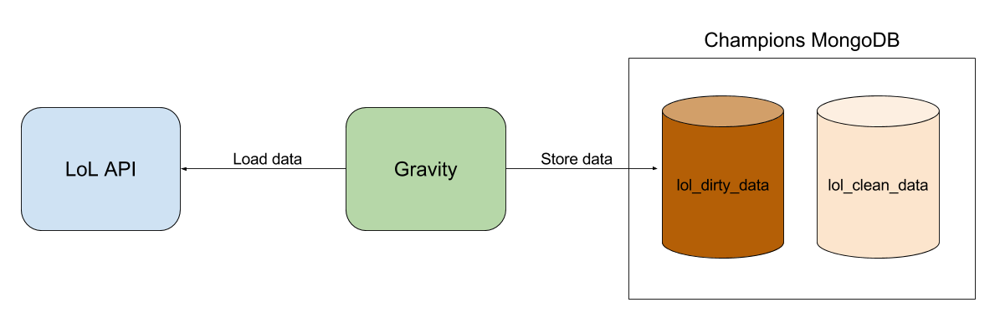

# Gravity

Gravity is the project responsible for get data from LoL API and store them in our database.



As you can see, we have two databases: _lol_dirty_data_ and _lol_clean_data_. The reason for it is the type of datas that we manipulate: **dirty** and **clean** datas.

#### Dirty data
LoL Matches’ data has a lot of informations that, most of them, we aren’t going to use for now. I called this data as **dirty**. 

Imagine a stone that inside has a diamond. We want the diamond, not the entire stone. But we need the stone to get the diamond. That’s the point. _lol_dirty_data_ store brute data (stones with diamonds). 

Gravity is like a miner: it just insert data in _lol_dirty_data_. It collects stones for other applications that know how to extract diamonds from stones.

#### Clean data
Our other database is _lol_clean_data_, where the diamonds are placed. 

All data treated by our applications (like **precog**) should be stored in it. The applications should load datas from _lol_dirty_data_ or others integration, compile them and store in _lol_clean_data_. 

Gravity will not insert data in _lol_clean_data_.

## Installation
Install MongoDB:
  - [Mac](https://docs.mongodb.com/manual/installation/)
  - [Linux](https://docs.mongodb.com/manual/administration/install-on-linux/)
  - [Windows](https://www.youtube.com/watch?v=dQw4w9WgXcQ)

Then install [Bundler](http://bundler.io/)

Now you can clone Gravity:
```
git clone https://github.com/jademcosta/gravity.git
```

On Gravity dir, install gems:
```
bundle install
```